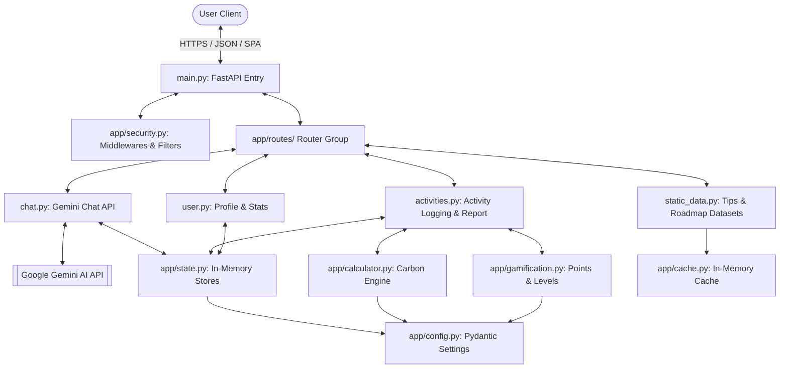

# 🌍 CarbonCompass

> **Navigate Towards a Greener Future**

AI-powered carbon footprint tracking web application built with FastAPI, Google Gemini AI, and a premium dark-theme single-page frontend. Designed for the Indian market with global applicability.

---

## 1. Project Overview & Problem Statement

### Problem Statement
Climate change is the defining challenge of our generation. However, most individuals lack awareness of how their daily actions (commutes, food choices, energy consumption) translate into carbon dioxide emissions. The lack of personalized, actionable guidance makes the transition to a sustainable lifestyle seem daunting and inaccessible.

### Project Overview
**CarbonCompass** bridges the climate awareness gap by providing a simple tracking mechanism, gamified progress markers, and AI-driven reduction coaching. By combining precise emission math (tailored to the Indian context, e.g. CEA grid factor) with Google Gemini AI conversational logic, users are empowered to understand their impact, build eco-conscious habits, and systematically reduce their carbon footprint.

---

## 2. System Architecture



---

## 3. Folder Structure

```
Carbon-Compass/
├── app/
│   ├── __init__.py          # Module initialization
│   ├── config.py            # Pydantic BaseSettings config loader
│   ├── constants.py         # Static datasets and carbon coefficients
│   ├── models.py            # Pydantic schemas (Request/Response)
│   ├── state.py             # Thread-safe global states
│   ├── security.py          # Security middlewares and input filters
│   ├── cache.py             # SimpleCache singleton & TTL wrappers
│   ├── calculator.py        # Carbon calculation math
│   ├── gamification.py      # Level/Points/Badges system logic
│   ├── logging_setup.py     # Structured logger
│   └── routes/
│       ├── __init__.py      # Routes subpackage init
│       ├── chat.py          # /chat endpoint (Gemini integration)
│       ├── activities.py    # /activities, /log-activity, /dashboard, /weekly-report
│       ├── static_data.py   # /tips, /roadmap, /badges, /facts
│       └── user.py          # /profile, /stats, /about
├── static/
│   └── index.html           # SPA frontend (CSS and JS inline)
├── .github/
│   └── workflows/
│       └── quality.yml      # CI/CD Quality Gate workflow
├── .flake8                  # Flake8 style preferences
├── pyproject.toml           # Pytest, Black, Isort, Mypy, Pylint configs
├── Makefile                 # Make commands for linting, testing, formatting
├── Dockerfile               # Production build instructions
├── test_main.py             # Automated test suite
├── conftest.py              # Test client fixtures & Gemini mock
├── ARCHITECTURE.md          # Exhaustive architectural details
├── CODE_QUALITY_REPORT.md   # Structural code quality review
└── requirements.txt         # Package dependencies
```

---

## 4. Design Decisions & Assumptions

### Design Decisions
- **Stateless Modular Routing**: Extracted monolithic route logic into modular `APIRouter` scripts to decouple domains and make testing individual components feasible.
- **Centralized Thread-Safe State**: Replaced loose dict definitions with encapsulated, `threading.RLock()`-protected state objects to prevent collision in concurrent server environments.
- **Cache-Aside Architecture**: Implemented static data caching (`SimpleCache`) to reduce unnecessary data parsing and API latency.
- **Strict Pydantic Validation**: Upgraded model parsing with detailed Field descriptions and `@field_validator` hooks to stop invalid parameters before they reach the controller layer.

### Assumptions
- **Gemini Key Presence**: The application assumes a `GEMINI_API_KEY` is always defined (validated fast at start time to fail immediately if missing).
- **In-Memory Volatility**: User session state, profiles, and logs are kept in-memory for ease of configuration; persistent scaling requires Redis or PostgreSQL.
- **Location Baseline**: Emission calculations default to India grid parameters (e.g. `0.82 kg CO2/kWh`) unless specified in the payload.

---

## 5. Installation & Usage Guide

### Prerequisites
- Python 3.11+
- Pip package manager

### Installation
1. Clone the repository:
   ```bash
   git clone https://github.com/bikashtiwari603/Carbon-Compass.git
   cd Carbon-Compass
   ```
2. Install dependencies:
   ```bash
   pip install -r requirements.txt
   ```
3. Create `.env` file containing your key:
   ```env
   GEMINI_API_KEY=your_actual_api_key_here
   ```

### Usage
Run the development server using:
```bash
make run
```
Access the application at `http://localhost:8080`.

---

## 6. Testing & Quality Enforcement

We enforce style, typing, formatting, and correctness using our Quality Gate suite.

### Run Tests
```bash
make test
```

### Run Code Formatting
```bash
make format
```

### Run Linting
```bash
make lint
```

### Type Checking
```bash
mypy app/ main.py
```

---

## 7. Future Improvements
- **Persistent Database**: Migrate in-memory session dictionaries to a PostgreSQL instance.
- **Distributed Caching**: Shift the singleton cache implementation to Redis for distributed horizontal nodes.
- **User Authentication**: Implement OAuth2 password-flow for secure registration and multi-device persistence.
- **Historical Analysis**: Integrate dynamic chart visualisations for comparing footprint metrics across multiple months.
